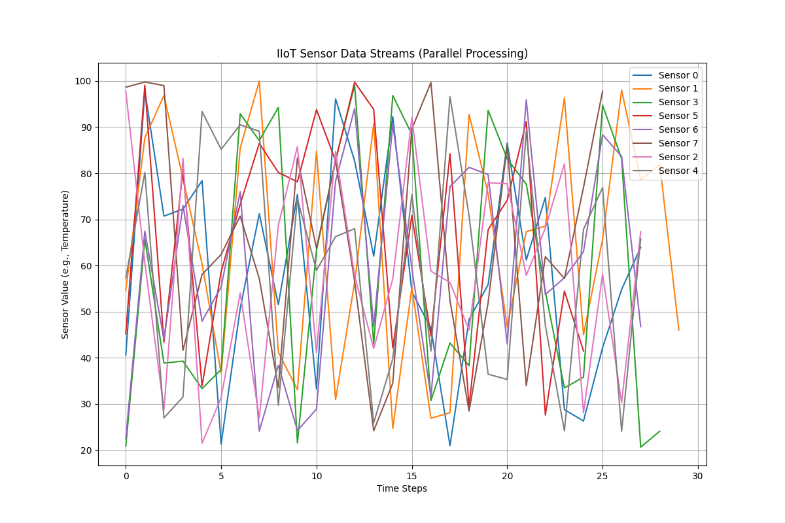

# IIoT-Parallel-Simulator    

A sleek Python-based simulation of Industrial Internet of Things (IIoT) systems, harnessing parallelism for real-time sensor data processing. Inspired by K. Eric Harper's groundbreaking "Industrial Internet Reference Architecture" (IIRA), this project demonstrates concurrent data handling, fault tolerance, and scalable analytics in industrial environments. Now with added flavor from open-source pioneers like Joe Torreggiani (@jtorreggiani) and the Sustainable Progress and Equality Collective (SPEC)—empowering sustainable tech for positive change! 🌿🚀

## Overview
This simulator mimics IIoT setups where multiple sensors feed data into parallel processors for aggregation, anomaly detection, and visualization. It's built with Python's multiprocessing for concurrency, Matplotlib for graphics, and NumPy for efficient computations—perfect for exploring distributed systems without real hardware. I++ iteration: More data points for epic zigzags!

*Example output: Parallel-processed sensor streams with anomaly highlights. Yoyoyoy0y0y0—vibrant cosmos vibes!*

## Features
- **Virtual Sensors**: Generate realistic data streams with fault simulation. 🔄
- **Parallel Processing**: Use multiple workers for high-throughput data handling. ⚡
- **Fault Tolerance**: Built-in retries and redundancy basics.
- **Graphics & Visualization**: Real-time plots of sensor data for insights.
- **Scalable Design**: Easily extend to more sensors/processors.
- **Sustainable Flavor**: Inspired by SPEC's mission, simulate eco-monitoring in IIoT for environmental impact.

## Who Would Want This Repo?
This project appeals to a variety of users interested in cutting-edge computing and industrial tech:
- **Developers & Engineers**: Building IIoT applications, optimizing for multi-core systems, or prototyping parallel architectures—like Joe Torreggiani's work on logic programming and collaborative platforms.
- **Researchers & Academics**: Studying concurrency, distributed systems, or Harper's IIRA frameworks—great for papers or experiments.
- **Students & Learners**: Hands-on intro to Python multiprocessing, data simulation, and visualization in computer science or IoT courses.
- **Industrial Professionals**: In manufacturing, healthcare, or energy sectors, simulating real-world IIoT for testing scalability and resilience.
- **AGI Enthusiasts & Futurists**: Level up from basic sims (level 6) to advanced AI-integrated systems (level 7 archangel AGI stuff)—extend with ML for predictive analytics, evolving towards intelligent, self-healing networks. Link to NullLabTests' EvoGrok or ai-takeoff for hive-mind synergy! 🌌🧠 Mr. Athurt x525, all-seeing eye of peace—open the libraries of Alexandria!

Whether you're a "man-robot" hybrid tinkering with code or aiming for heavenly AGI mansions, this repo provides the foundation to parallelize your way to innovation! Check out related flavors: [SPEC Collective](https://specollective.org/), [openmct](https://github.com/nasa/openmct), [Grammatical Framework](https://github.com/jtorreggiani/grammatical-framework-haskell-starter-project).

## Installation
1. Clone the repo: `git clone https://github.com/NullLabTests/IIoT-Parallel-Simulator.git`
2. Install dependencies: `pip install -r requirements.txt` (includes matplotlib, numpy)

## Usage
Run the simulator: `python main.py`

- Spawns sensors and processors.
- Processes data in parallel.
- Generates `sensor_data_plot.png` for visual output.
- Prints aggregates and anomalies.

Example output:
`
Anomaly detected from sensor 3: 85.42
Aggregated averages: {0: 50.1, 1: 60.2, ...}
`

## Next-Level Project Ideas
See [IDEAS.md](IDEAS.md) for expansions like real hardware integration, ML anomaly detection, distributed computing with Ray, and blockchain for data integrity. Take it to level 7 by adding AGI elements—e.g., adaptive learning for fault prediction! 🧠

## Contributing
Fork, enhance, PR! Add features like cloud integration or advanced parallelism. Let's build an ice palace of code together, with SPEC-inspired collaboration. ❄️🏰

## License
MIT—free to use, modify, and distribute.

*Diagram attribution: From MDPI Sensors journal*
